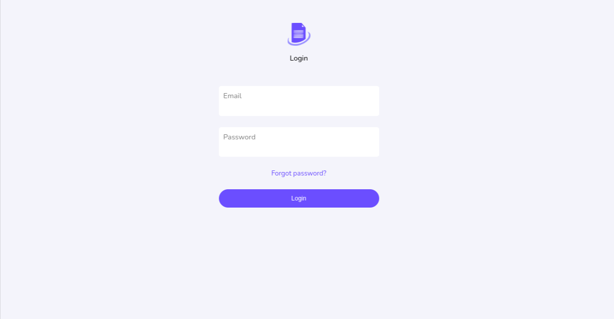
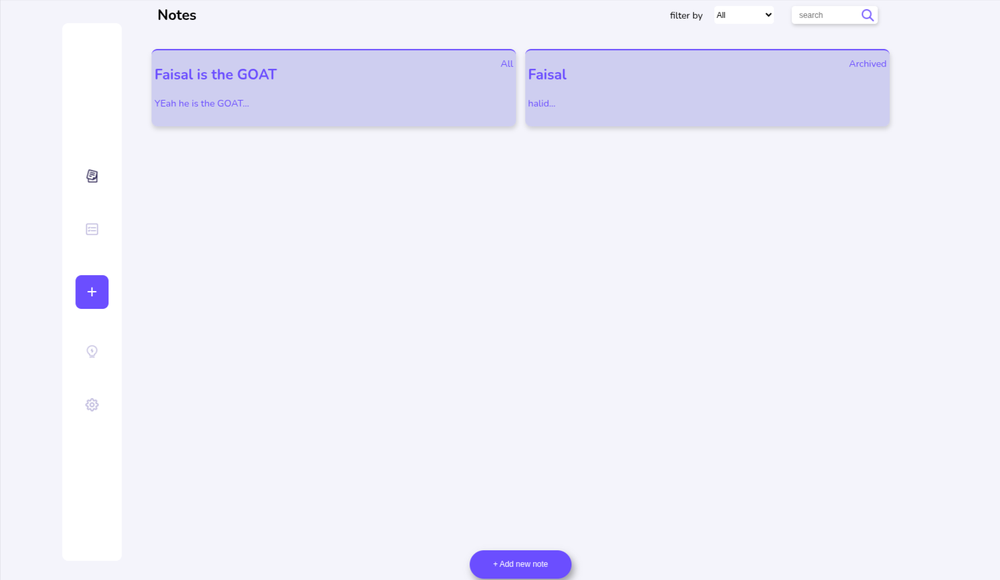
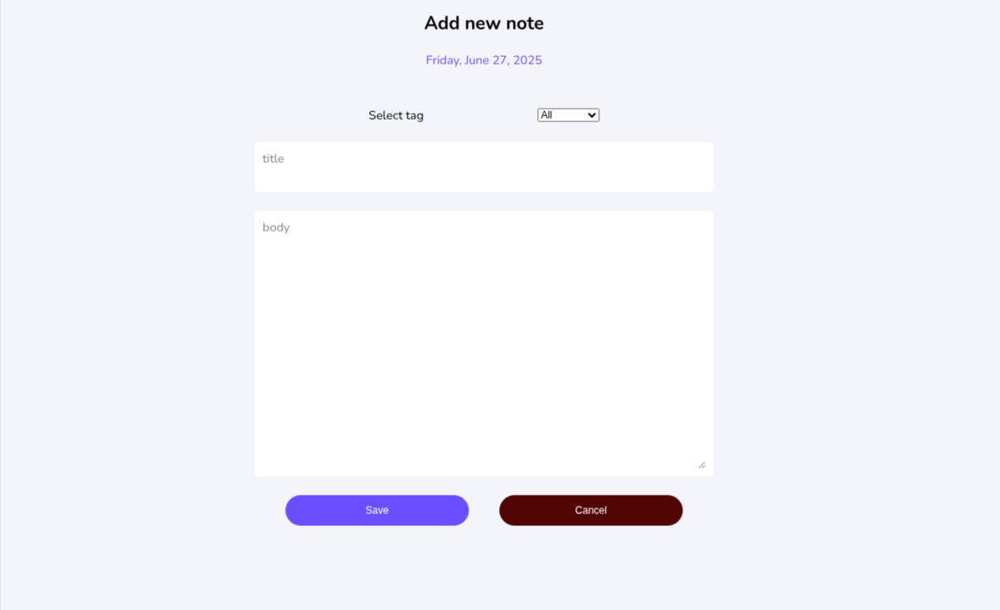

# Note-App

## Description

Note-App is a full-stack web application that allows users to create, manage, and organize their notes. It features user authentication, enabling users to securely store and access their personal notes.

## Features

*   **User Authentication:** Secure registration and login system.
*   **Note Management:**
    *   Create new notes with rich text content.
    *   View all notes in a list or individual view.
    *   Edit existing notes.
    *   Delete notes.
*   **Responsive Design:** User-friendly interface accessible on various devices.

## Technologies Used

*   **Frontend:** Angular (v19+)
*   **Backend:** Firebase
*   **Styling:** SCSS
*   **Notifications:** ngx-toastr

## Project Structure

*   **`src/`**: Contains the Angular frontend application code.
    *   **`app/`**: Angular components, services, models, guards, etc.
    *   **`assets/`**: Static assets like images.
    *   **`styles.scss`**: Global styles.
* 
*   **`public/`**: Publicly accessible assets.
*   **`angular.json`**: Angular project configuration.
*   **`package.json`**: Project dependencies and scripts.

## Installation

### Frontend (Angular)

1.  **Clone the repository:**
    ```bash
    git clone <repository-url>
    cd note-app
    ```
2.  **Install Node.js dependencies:**
    ```bash
    npm install
    ```


## Usage

### Running the Development Server

1.  **Start the Angular development server:**
    ```bash
    ng serve
    ```
    The application will be available at `http://localhost:4200/`.

## Screenshots


*   **Login Page:** 
*   **Notes List:** 
*   **Create Note:** 


## Contributing

Contributions are welcome! Please follow these steps:

1.  Fork the repository.
2.  Create a new branch (`git checkout -b feature/your-feature-name`).
3.  Make your changes.
4.  Commit your changes (`git commit -m 'Add some feature'`).
5.  Push to the branch (`git push origin feature/your-feature-name`).
6.  Open a Pull Request.

## Author

*   **Faisal** 
*   **GitHub:** https://github.com/Proc3ssa
*   **x:** https://x.com/processor_911
